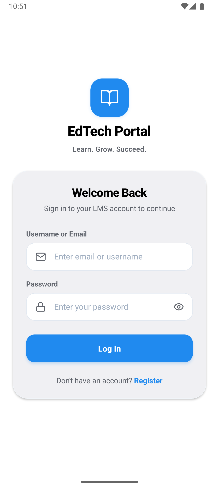
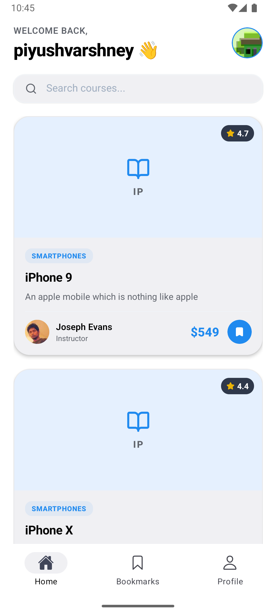
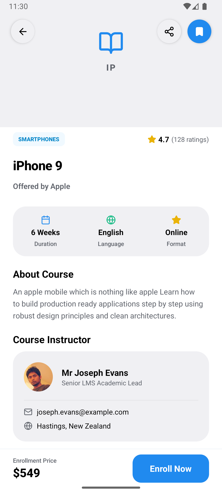
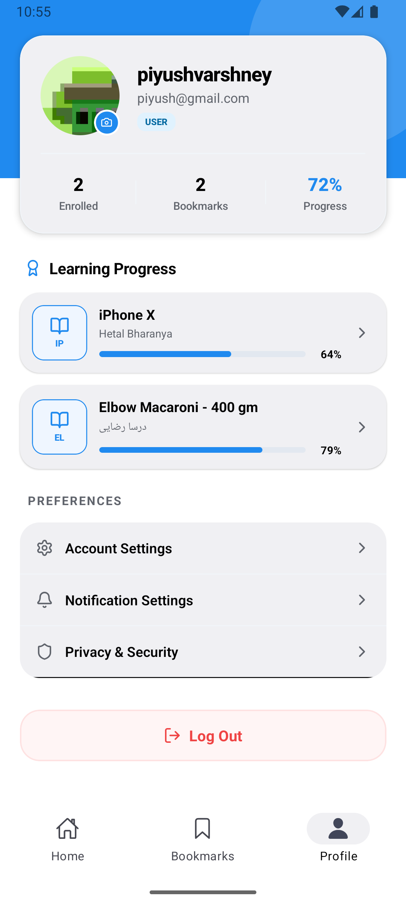

# 🎓 Mini LMS Mobile Application (Expo SDK 56)

A high-performance, resilient, and visually premium Mini Learning Management System (LMS) mobile application. Built using **React Native Expo (SDK 56)**, **TypeScript**, **NativeWind (v5 / Tailwind v4)**, and **LegendList** for ultra-smooth list recycling.

---

## 📱 App Screens & Navigation Flows

Below is the layout map of the primary screens showing the premium redesigned UI:

| 🔐 Login & Signup | 📚 Course Catalog (Home) |
| :---: | :---: |
|  <br> *Auth Flow & Validation* |  <br> *Recycled List with Search* |

| 📖 Course Details | 👤 User Profile Dashboard |
| :---: | :---: |
|  <br> *Enroll & Details View* |  <br> *Avatar Picker & Learning Progress* |

---

## 🛠️ Key Architectural Decisions

### 1. Robust Network Layer & Resilient API Client (`src/api/client.ts`)
The app utilizes a centralized, custom fetch client designed to handle standard mobile connectivity issues:
* **Request Timeouts:** All network requests are controlled via an `AbortController`. If a request takes longer than `TIMEOUT_MS` (default 10s), the controller halts the execution and returns a descriptive `408 Request Timeout` error.
* **Automatic Retry with Exponential Backoff:** If a request encounters a network dropout (status code `0`, `TypeError`) or server-side failure (`5xx`), it executes a retry loop up to 3 times. The backoff delay escalates exponentially:
  $$\text{Delay} = 2^{\text{attempt}} \times 1000\text{ ms}$$
* **Atomic Token Refresh & Queue Interception:** When an API request fails with a `401 Unauthorized`:
  1. The client intercepts the failure and holds additional outgoing requests in a queue (`refreshSubscribers`).
  2. It triggers a token refresh using the stored refresh token at `/users/refresh-token`.
  3. Once new tokens are retrieved and written, it updates all queued requests with the new `Authorization` headers and executes them atomically.

### 2. Recycled List Performance (`src/app/(tabs)/index.tsx`)
Rather than relying on `FlatList` (which instantiates and retains off-screen elements in memory, causing frames to drop), the catalog utilizes `@legendapp/list/react-native` (`LegendList`):
* **Recycling mechanism:** Reuses cell views offscreen, reducing memory allocations on deep lists.
* **Estimated Sizes:** Utilizes `estimatedItemSize={300}` to drastically speed up list render calculations.
* **Component Memoization:** The individual `CourseCard` items are wrapped in a optimized `React.memo` with a custom props comparator that prevents a card from re-rendering unless its specific ID, title, thumbnail, or bookmark state changes.

### 3. Local HTML Hybrid WebView (`src/app/webview.tsx`)
To load course contents securely:
* **Token Headers Injection:** Intercepts load requests to pass dynamic `Authorization` and `X-Course-Id` headers directly into the WebView session, preventing content access if the user's session has expired.
* **Dual Asset Loading:** Tries to read the pre-packaged `assets/course_content.html` file. If the local file reads fail (e.g. Metro bundler HTTP URL restrictions on emulators), it dynamically falls back to an offline-safe inline `FALLBACK_HTML` string.
* **Bidirectional Message Bridge:** WebView code posts JSON string messages back to the native environment (e.g. sending `{ type: 'COURSE_COMPLETED' }` when the user marks the module done). Native app parses this in the `onMessage` handler and updates the database context.

### 4. Hybrid Offline Storage & Cache Syncing
* **Secured Storage:** High-sensitivity session keys (`access_token`, `refresh_token`) are locked in the device keychain via **Expo SecureStore**.
* **Async Cache:** Heavy list metadata (bookmark lists, enrolled lists, course catalogs) are cached in **React Native AsyncStorage**. On boot, cached files load immediately to provide offline usability, while remote API fetches sync details in the background.

---

## ⚙️ Environment Variables

The API client connects to the default testing endpoint: `https://api.freeapi.app/api/v1`.

To customize the backend endpoint, you can define public environment variables which are automatically read by Expo:

1. Create a `.env` file in the root directory:
   ```bash
   touch .env
   ```

2. Add your custom backend API URL (prefix with `EXPO_PUBLIC_` so it's readable by the client-side JavaScript bundle):
   ```env
   EXPO_PUBLIC_API_URL=https://your-custom-backend.com/api/v1
   ```

3. Start the bundler (`npm start`). The API client in [client.ts](file:///Users/piyushvarshney/Desktop/House_of_EdTech_Task/src/api/client.ts) will automatically intercept and run against this custom URL.

---

## 📦 Setup & Installation Guide

### Prerequisites
* **Node.js** (v18.0.0 or higher)
* **npm** (v9+) or **yarn** (v1.22+)
* **Android SDK & Emulator** (Android Studio) OR **Xcode Simulator** (macOS only)

### Step-by-Step Installation

1. **Clone the Repository:**
   ```bash
   git clone <repository-url>
   cd House_of_EdTech_Task
   ```

2. **Install Dependencies:**
   ```bash
   npm install
   ```

3. **Verify/Install Expo Globals:**
   ```bash
   npm install -g expo-cli eas-cli
   ```

### Running the App Locally

* **Standard Expo Go Execution:**
  To launch the app using the standard Expo Go client:
  ```bash
  npx expo start
  ```
  * Press `a` to open on the Android Emulator.
  * Press `i` to open on the iOS Simulator.
  * Scan the QR code with your mobile camera to test on physical devices.

* **Development Build Execution (Required for Notifications):**
  If you want to compile and build a native developer binary (needed for native features like local notifications):
  ```bash
  # Android Development Build
  npx expo run:android

  # iOS Development Build
  npx expo run:ios
  ```
  This generates the native `android` and `ios` folders and runs a custom client application instead of Expo Go.

---

## ⚠️ Known Issues & Limitations

### 1. Notifications Restricted on Expo Go (SDK 53+)
* **Issue:** Starting with Expo SDK 53, the push/local notification native libraries were removed from the **Expo Go** application to minimize size. Trying to initialize `expo-notifications` on Expo Go causes a crash or hard warnings.
* **Limitation:** In the code, notifications are guarded using `Constants.appOwnership !== 'expo'`. This means notifications are inactive when testing inside Expo Go.
* **Testing Workaround:** You must generate a custom Development Build (using `npx expo run:android` or `npx expo run:ios`) to test notifications and see the permission dialog.

### 2. FreeAPI Database Purges (Auto-Logout Behavior)
* **Issue:** The public sandbox API (`freeapi.app`) is transient and automatically resets its mock databases periodically.
* **Limitation:** When this reset occurs, the user account is purged on the server side. As a result, the saved local `refresh_token` becomes invalid, leading to a `401` on startup, which triggers the logout sequence. This is expected security behavior.

### 3. Android WebView Development URL Resolving
* **Issue:** On the Android Emulator, Metro bundler resolves local assets as remote HTTP URLs (e.g. `http://10.0.2.2:8081/...`). Expo's `FileSystem.readAsStringAsync()` throws an error when trying to read HTTP addresses.
* **Resolution:** The WebView component contains a check that detects `http`/`https` asset paths and fetches them via a standard network call, ensuring the HTML viewer works on emulators without manual configuration.
